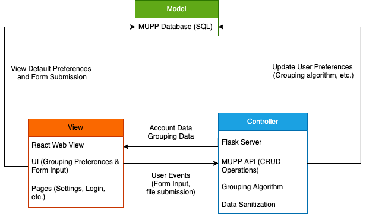
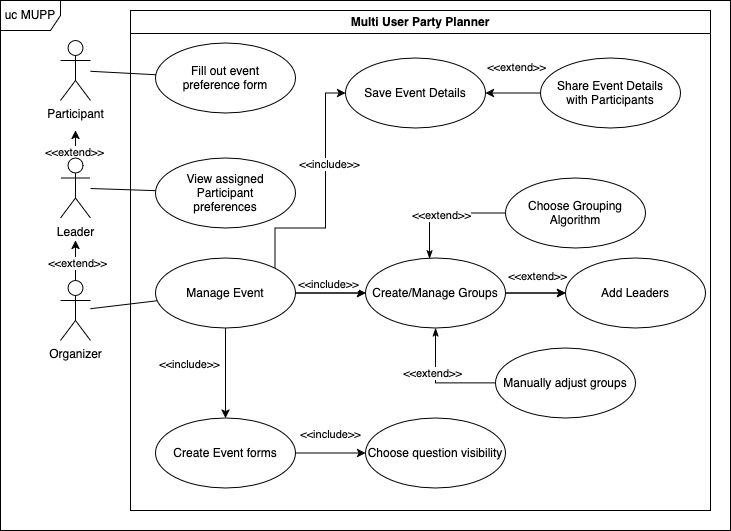

# Multi-User Party Planner Design Documentation

## Team Information
* Team name: The MUPPets
* Team members
  * Andrew Bradbury
  * Christian Ashley
  * Jojo Kaler
  * Shahmir Khan
  * Tyler Jaafari

## Executive Summary

The Multi-User Party Planner (MUPP) is a tool to generate matching of Event
Participants to Leaders. This application is inspired by tabletop gaming
events, but can be abstracted to additional uses. The central theme is to
coordinate matches of a team Leader (e.g. if a game master prefers technical
or role play) with Participants with similar goals. To generalize, Organizers
of an Event can generate customs forms for attendees to fill out. Once the
submission period has ended, an Organizer may manually or algorithmically
generate groups and their meeting times.

## Requirements

This section describes the features of the application.

### Definition of MVP
> _Provide a simple description of the Minimum Viable Product._

### MVP Features
1. As an Organizer, I want to generate a grouping of guests for my event so
that I can better run my event
2. As an Organizer, I want to be able to tweak the grouping variables so that I
can be in full control over the grouping before it is made
3. As an Organizer, I want to be able to adjust groupings manually after they
are made, so that I can correct mistakes or adapt to changing needs.
4. As an Organizer, I want to be able to share the groupings that are generated
so that I can share that information with the Participants of the event
5. As an Organizer, I want to be able to add Leaders so that the grouping
algorithm spreads them throughout the groups
6. As an Organizer, I want to be able to create event forms so that guests can
be properly grouped according to preference and skill level.
7. As a Participant, I want to fill out a form so that my preferences can be
accounted for during an event.
8. As an Organizer, I want to be able to set the visibility of individual
questions so that Leaders can selectively view Participants’ answers.
9. As a Leader, I want to be able to view the preferences of the Participants
so that I can better plan for the Event’s session(s).
10. As an Organizer, I want to be able to create an account so that all of my
event information is saved
11. Stretch: As an Organizer, I want to be able to generate a schedule so that
Participants/Leaders can follow it to their respective groups
12. Stretch: As an Organizer, I want to be able to upload a file of information
on the guests so that I can use predefined information to generate groups

## Architecture and Design

This section describes the application architecture.

### Software Architecture

The Model for our application will be held in a database, storing information on the
users of our applcation (Event Organizers), sessions, and events. Our users will interact
with a React web application front-end, navigating through pages and filling out user forms.
The data from the React app is sent to our Flask server, which handles interaction with the MUPP API,
data validation, and the grouping algorithm.

### Use Cases

The primary user of the application will be Event Organizers. They will need
functionality to generate forms and groups as well as manage other Event
details like time. Leaders may need to view Participants' preferences, and
Participants need to fill out an Organizer's form.

